# Linux Server Configuration Project
## Full Stack Web Developer Nanodegree - Udacity

____
## Table of Contents

+ [Getting Started With Lightail](#getting-started-with-lightsail)
+ [Connect using your own SSH client application](#connect-using-your-own-ssh-client-application)
  * [Create a Static IP](#create-a-static-ip)
  * [Create the private key-pair](#create-the-private-key-pair)
  * [Connect from your terminal](#connect-from-your-terminal)
+ [Change ssh port](#change-ssh-port)
+ [Configure the timezone to UTC](#configure-the-timezone-to-utc)
+ [Configure the server firewall rules](#configure-the-server-firewall-rules)
  * [Protect SSH with Fail2Ban](#protect-ssh-with-fail2ban)
+ [Create a new User](#create-a-new-user)
  * [Give the new user sudo privileges](#give-the-new-user-sudo-privileges)
  * [Create a strong key-pair authentication](#create-a-strong-key-pair-authentication)
  * [Access the server as the new user](#access-the-server-as-the-new-user)
+ [Installing PostgreSQL](#installing-postgresql)
  * [Installation](#installation)
  * [Disable remote connections](#disable-remote-connections)
  * [Test the local connection](#test-the-local-connection)
+ [Install Apache2](#install-apache2)
+ [Set up the Flask Application](#set-up-the-flask-application)
  * [Clone the application](#clone-the-application)
  * [Test the dependencies](#test-the-dependencies)
  * [Create and setup the WSGI file](#create-and-setup-the-wsgi-file)
  * [The virtual host](#the-virtual-host)
  * [Ad hoc app configuration](#ad-hoc-app-configuration)
  * [Useful commands](#useful-commands)

[References](#references)


# Introduction
In this project we will cover all the steps necessary to install a Linux server and host a web application with a postgres database.

The web application we'll be hosting is the `catalog-app` created during the Project # 2 of this course.
The full application code for the app and all the necessary steps to configure it for production can be found at this [git repository](https://github.com/pierva/catalog-app).

The preview of the running application can be found at this address:
www.piervaleriovignola.com

To learn all the application features and how it works please refer to the app [repository readme](https://github.com/pierva/catalog-app).

#### Hosting Server Details

public (static) ip: 3.209.74.0
<br>
port: 2200
<br>
uri: http://www.piervaleriovignola.com

## Getting Started With Lightail
Lightail is the easiest way to get started with AWS. It allows you to launch a virtual private server in just few clicks. You don't have to worry about all the infrastructure setup.

Login into your [Lightail account](https://lightsail.aws.amazon.com/ls/webapp/home/instances) and in the home page click on "create instance" button.


In the next page select the Instance Location (recommended to select the closest location from you), then in *Select Platform* choose `Linux/Unix` and in the *Select a blueprint* click on `OS Only` and select `Ubuntu`.

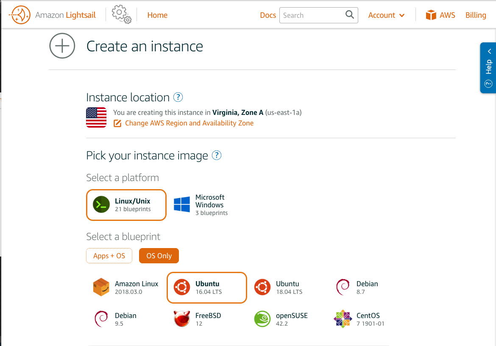

Keep all the default settings for now
*Choose your instance plan*, give a name to your instance and finally click on `Create Instance`.


After clicking the button, the new instance will be created. The process will take few seconds to complete.
In the home page now you'll see the new instance.


To connect to the instance click on the terminal icon 

A new terminal window (within a browser) will open and you're connected to your machine.


It is not very easy to work with this terminal in the window, because some operations such us copy-paste won't work. We'll set up the connection to the new machine from your own SSH client (terminal/PuTTY).

## Connect using your own SSH client application

### Create a static IP
It is recommended to create a static IP address for your machine before setting up the key-pairs authentication process.

Click on the newly created instance name to enter the management page. Alternatively you can enter the management page by clicking on the vertival ellipsis next to the machine name and select `Manage`.

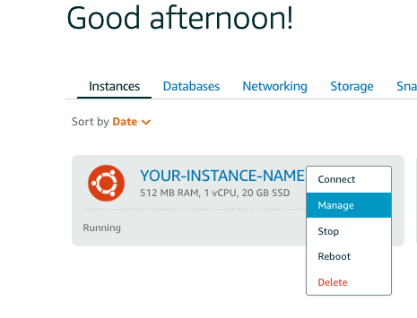

In the new page, select the *Networking* tabk and click on `Create static IP`.

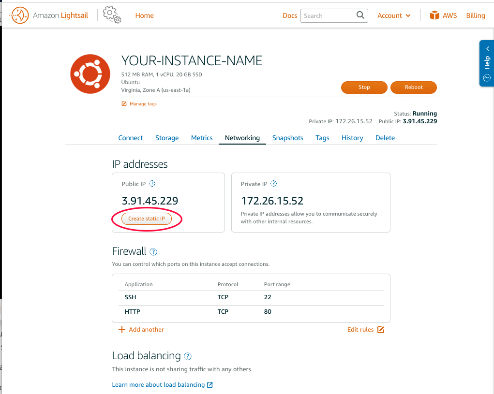

After clicking the button a new page will open. In this page the default settings in the top part are generally fine, you can change the Static IP location if you want.
Give a name to your static IP if you prefer and click on `Create`.

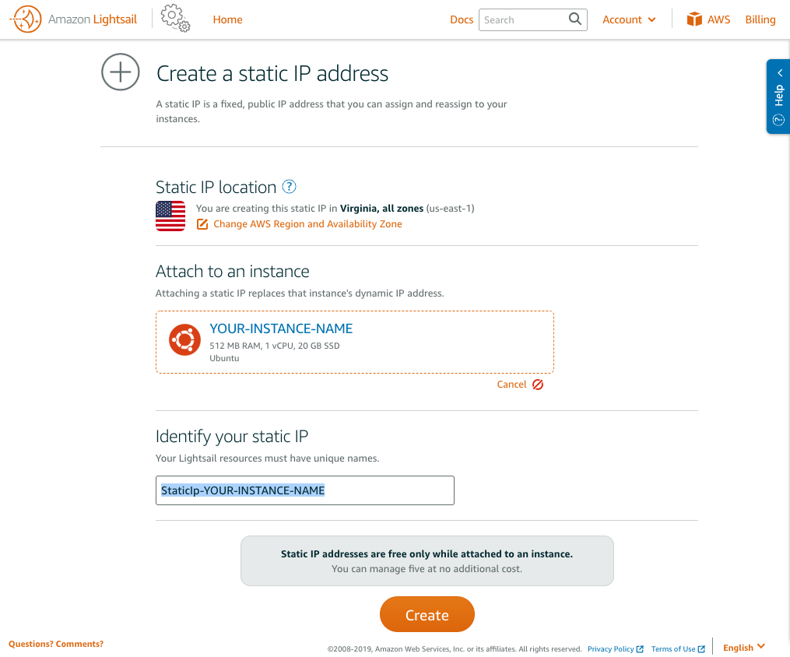

You'll get a new *Public static IP address*. This is what we'll use to connect to the machine.

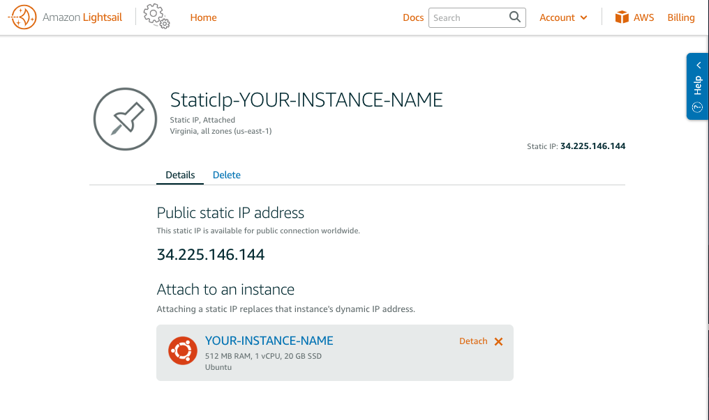


### Create the private key-pair

We need to create a key pair that will be used to authenticate to the Virtual Machine.
In your client terminal type the following command:

```sh
$ ssh-keygen
```
You'll be prompted to enter the file in which to save the key:
```sh
Generating public/private rsa key pair.
Enter file in which to save the key (/Users/user/.ssh/id_rsa): /Users/user/.ssh/YOUR-INSTANCE-KEY
```
Then you'll be asked to enter a passphrase for the new key. Recommended to not leave it empty.

After typing the password, two files will be generated in the location you specified.
You can check it by typing:
```sh
ls ~/.ssh
```

You'll see something like this:
```sh
$ ls
YOUR-INSTANCE-KEY
YOUR-INSTANCE-KEY.pub
```
Let's copy the public key in the clipboard so we can paste it in the virtual machine.

```sh
sudo cat ~/.ssh/YOUR-INSTANCE-KEY.pub
```
You should be prompted for a password, type your local machine (mac/windows) password.

Copy the output string that begins with "ssh-rsa ...."

Go to the aws [lightsail console](https://lightsail.aws.amazon.com/ls/webapp/home/instances) and connect to the instance from using the terminal icon or by clicking on `Connect using SSH` inside the instance management page.

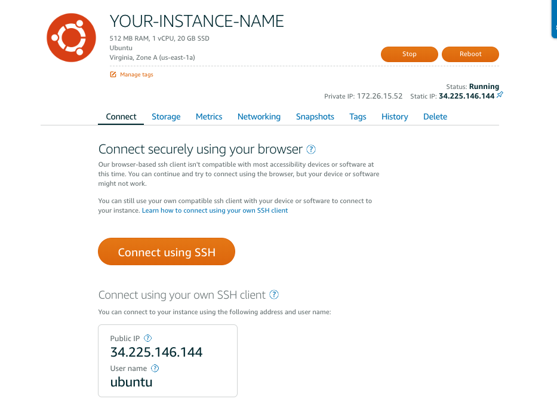

In the terminal let's navigate in the `.ssh` folder:

```sh
$ cd .ssh
```

The fastest way to upload the file is to remove the existing `authorized_keys` file, create a new one and paste the copyed public key.

```sh
$ sudo rm authorized_keys

$ sudo nano authorized_keys
```
To paste in this terminal:
1. press the clipboard button in the toolbard (bottom right)
2. paste the content in the text area
3. close the clipboard by clicking the same button
4. focus on the terminal (click on the terminal) and right click with the mouse

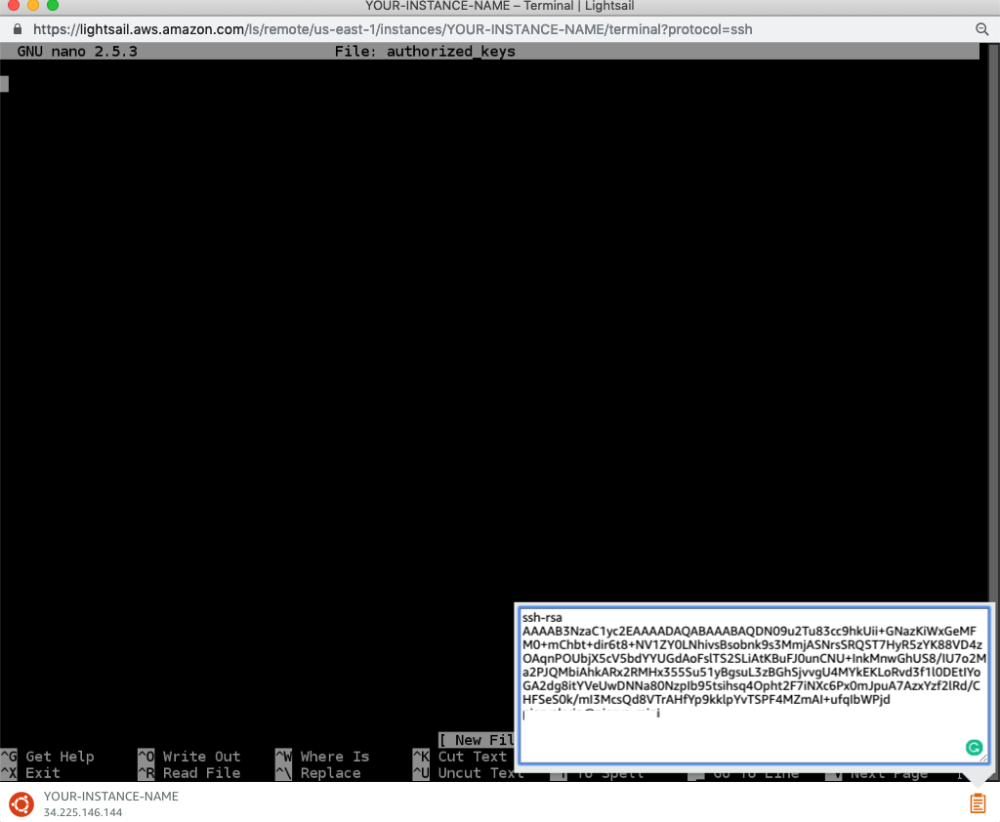
Now you can save and close the file `ctrl+x`, `Y`, and `enter`.

One last thing we need to do to do is set up some specific file permissions on the authorized key file and SSH directory.
This is a security measure that SSH enforces to ensure other users cannot gain access to your account.

```sh
$ sudo chmod 700 ~/.ssh
$ sudo chmod 644 ~/.ssh/authorized_keys
```

### Connect from your terminal
Now that we have a strong authentication process in place we can connect to the machine directly from the client terminal (PuTTY).
In your terminal type the below command:

```sh
$ ssh ubuntu@xx.xxx.xxx.xxx -i ~/.ssh/YOUR-INSTANCE-KEY
```

Insert your IP address and make sure that the path and file name to your private key is correct.

## Change ssh port
Now that we are logged in we can go ahead and setup our server as we like.

Let's start by changing the SSH port from 22 to 2200.
To make this change we need to change the port number in the `sshd_config` file.

```sh
sudo nano /etc/ssh/sshd_config
```

Locate the line that says
```
# What ports, IPs and protocols we listen for
Port 22
```
and change 22 to 2200.
```
# What ports, IPs and protocols we listen for
Port 2200
```

For a better security of our server we also need to disable `RootLogin`. Set the `PermitRootLogin` to `no`.
```
# Authentication:
LoginGraceTime 120
PermitRootLogin no
```
Save and exit. Restart the sshd service.
```sh
sudo service sshd restart
```
Before we can use the port we need to enable it in the instance firewall in the [aws lightsail console](https://lightsail.aws.amazon.com/ls/webapp/us-east-1/instances/YOUR-INSTANCE-NAME/networking).
Inside your `instance` page select the *Networking* tab and under the *Firewall* section click on `+ Add another`.

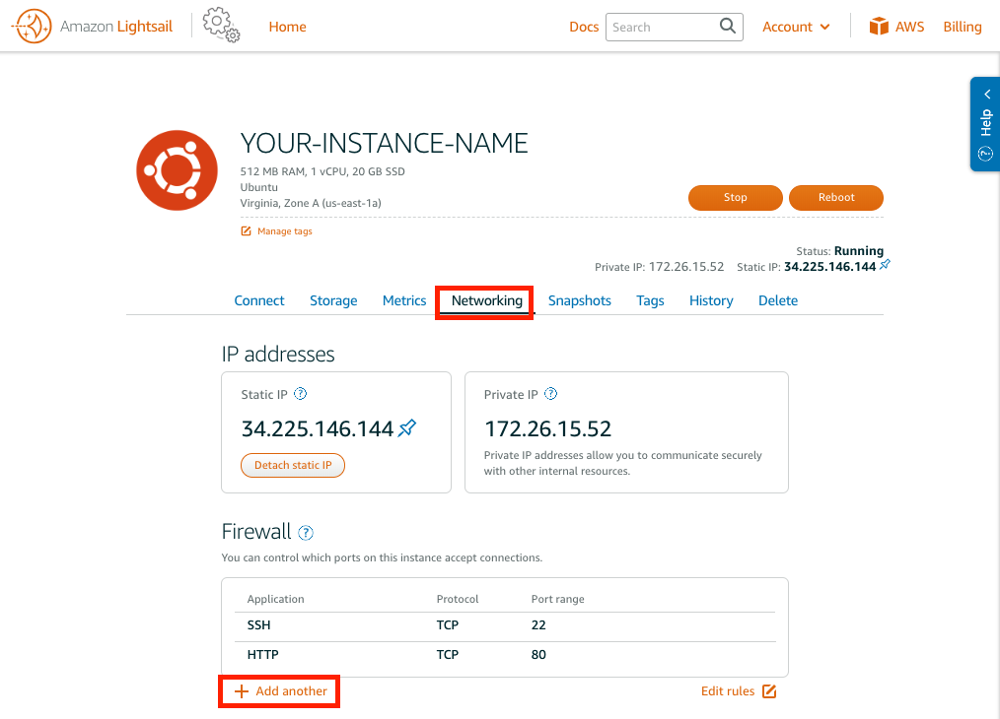
Let's test that the port is actually working.

Insert the new port 2200 in the Port range. Application should be Custom and Protocl TCP. Save the new configuration.
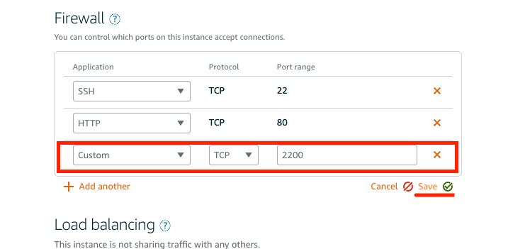


Now we can test if everything is working as it should. Exit the machine if not already done. From your client terminal:
```sh
exit
```
Now let's try the SSH with the new port (Insert your IP and the path to the secret key).

```sh
$ ssh ubuntu@xx.xxx.xxx.xxx -p 2200 -i ~/.ssh/YOUR-INSTANCE-KEY
```
If you're prompted to enter the password and then you enter the machine you're all set.

```sh
$ ssh ubuntu@xx.xxx.xxx.xxx -p 2200 -i ~/.ssh/YOUR-INSTANCE-KEY

Enter passphrase for key '/Users/piervalerio/.ssh/YOUR-INSTANCE-KEY':
Welcome to Ubuntu 16.04.4 LTS (GNU/Linux 4.4.0-1052-aws x86_64)

 * Documentation:  https://help.ubuntu.com
 * Management:     https://landscape.canonical.com
 * Support:        https://ubuntu.com/advantage

  Get cloud support with Ubuntu Advantage Cloud Guest:
    http://www.ubuntu.com/business/services/cloud

0 packages can be updated.
0 updates are security updates.

New release '18.04.2 LTS' available.
Run 'do-release-upgrade' to upgrade to it.


Last login: Tue Mar 26 23:10:12 2019 from 170.250.216.229
ubuntu@ip-xxx-xx-xx-xx:~$
```

## Configure the timezone to UTC
To set the server clock to UTC (default) we can type the following command:
```sh
sudo dpkg-reconfigure tzdata
```
This will open the setting page where you can choose the timezone for the machine.

Select `None of the above` in the first page.

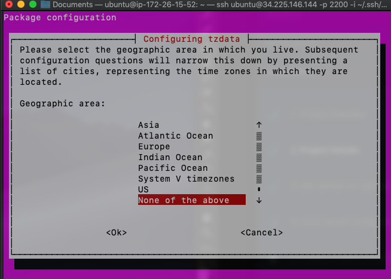

In the subsequent page select UTC and click ok.
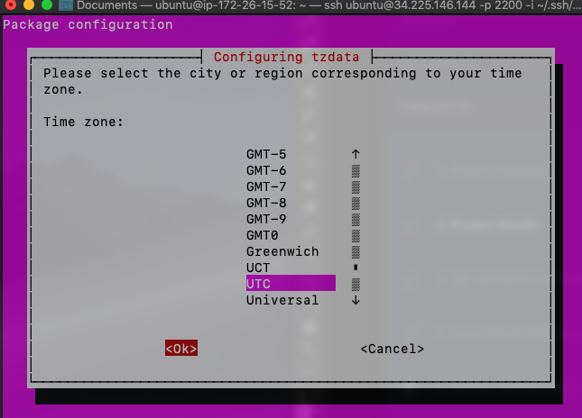

____

## Configuring the server firewall rules
Now that we have configured our server as we like is time to configure and enable the virtual machine firewall.

Check the firewall status with:
```sh
$ sudo ufw status
```
By default the firewall is inactive.

**Before enabling the firewall make sure that is configured correctly, otherwise you may risk to be locked out of your lightsail instance**

The port we want to enable are:
* 80 (HTTP)
* 2200 (SSH)
* 123 (NTP)

Let's start by disabling all the incoming ports and enabling all the default outgoing.

```sh
$ sudo ufw default deny incoming
$ sudo ufw default allow outgoing
```
Now we can enable our ports:
```sh
$ sudo ufw allow www
$ sudo ufw allow 2200/tcp
$ sudo ufw allow 123/udp
```
If you're completely sure that the rules are set up properly, you can now enable the firewall.
```sh
$ sudo ufw enable
```

If you now run the command `sudo ufw status`, you should get the following output:
```
Status: active

To                         Action      From
--                         ------      ----
80/tcp                     ALLOW       Anywhere                  
2200/tcp                   ALLOW       Anywhere                  
123/udp                    ALLOW       Anywhere                  
80/tcp (v6)                ALLOW       Anywhere (v6)             
2200/tcp (v6)              ALLOW       Anywhere (v6)             
123/udp (v6)               ALLOW       Anywhere (v6)
```
### Protect SSH with Fail2Ban
Since the SSH deamon is a service that must be exposed to the internet to function properly, it creates a vector of attack.
We can mitigate this problem by using a service called **fail2ban**. This service creates rules that can automatically alter the `iptables` firewall configuration based on a predefined number of unsuccessful login attempts.

Full instructions on how to use Fail2Ban can be found [here](https://www.digitalocean.com/community/tutorials/how-to-protect-ssh-with-fail2ban-on-ubuntu-14-04)

Install the service
```sh
$ sudo apt-get install fail2ban
```
The fail2ban configuration file is located in the `/etc/fail2ban` directory. The file is called `jail.conf`. To customize the configuration it is recommended to create a new file and call it `jail.local`. This second file should only contain deviations from the default configuration.

```sh
$ sudo nano /etc/fail2ban/jail.local
```

By default the SSH jail is enabled. Since we changed the SSH port to 2200, you may want to change the port in the `[sshd]` section. You enable a service by adding `enabled = true`.

```
[sshd]
enabled = true
port = 2200
```

Save and exit the file.

Activate the service and restart.
```sh
$ sudo systemctl enable fail2ban
$ sudo systemctl restart fail2ban
```

We can setup the fail2ban firewall to allow established connections, traffic generated by the server itself, traffic destined for our SSH and web server ports. We will drop all other traffic. We can set this basic firewall up by typing:

```sh
$ sudo iptables -A INPUT -i lo -j ACCEPT
$ sudo iptables -A INPUT -m conntrack --ctstate ESTABLISHED,RELATED -j ACCEPT
$ sudo iptables -A INPUT -p tcp --dport 22 -j ACCEPT
$ sudo iptables -A INPUT -p tcp -m multiport --dports 80,443 -j ACCEPT
$ sudo iptables -A INPUT -j DROP
```
You can check the current firewall rules by typing:
```sh
$ sudo iptables -S
```

You can save the firewalls so that they survive a reboot by typing:
```sh
$ sudo dpkg-reconfigure iptables-persistent
```

Restart fail2ban to implement the wrapping rules:
```sh
$ sudo service fail2ban start
```

## Create a new User
In this section we'll create a new user called `grader`.
To create our new user it is necessary to have `sudo` rights. If we are logged in as ubuntu we're fine. When we add the new user we'll be prompted with few questions including the password for the new user.

```sh
$ sudo adduser grader

Adding user `grader' ...
Adding new group `grader' (1001) ...
Adding new user `grader' (1001) with group `grader' ...
Creating home directory `/home/grader' ...
Copying files from `/etc/skel' ...
Enter new UNIX password:
Retype new UNIX password:
passwd: password updated successfully
Changing the user information for grader
Enter the new value, or press ENTER for the default
	Full Name []: grader
	Room Number []:  
	Work Phone []:
	Home Phone []:
	Other []:
Is the information correct? [Y/n] y
```
### Give the new user sudo privileges
Ubuntu creates a folder with all the users with pseudo privileges. You can check who has pseudo privileges with the following command.

```sh
$ sudo ls /etc/sudoers.d
```

In this folder you'll find a default user called `90-cloud-init-users`.

1. Let's make a copy of this file.

```sh
$ sudo cp /etc/sudoers.d/90-cloud-init-users /etc/sudoers.d/grader
```

2. Open the file
```sh
$ sudo nano /etc/sudoers.d/grader
```
3. Change ubuntu with the new user: grader. The below line will allow the user to type commands as sudo without requesting the password.
```
# User rules for ubuntu
grader ALL=(ALL) NOPASSWD:ALL
```

If you want the user to type the password when using sudo, write this line instead:

```
# User rules for ubuntu
grader ALL=(ALL) ALL
```

4. Save and close the file

5. If you want to force the new user to change the password after the login, type the following command:

```sh
$ sudo passwd -e grader
```
The `-e` flag will basically expire the password.

### Create a strong key-pair authentication
Follow the steps described in section 2.2

### Access the server as the new user

Access the server as `grader` (private key provided in the note for the instructor):
```sh
$ ssh grader@34.225.146.144 -p 2200 -i ~/.ssh/<private-key-file>
```
The ssh authorized keys file is located in the following directory `/.ssh`:
```sh
$ cd ~/.ssh/authorized_keys
```

## Installing PostgreSQL
Installing and setup the database on the linux machine can be somehow tricky. We'll break it down all the necessary steps in order to make the process as simple as possible.

Let's start by updating the machine.
```sh
$ sudo apt-get update
$ sudo apt-get upgrade
```

### Installation
```sh
$ sudo apt-get install postgresql postgresql-contrib
```
This will install the latest version of the postgresql server locally. Additionally togheter with the server it will be installed all the commonly used add-ons for it.

To start we need to create the role postgres and setup the password.

```sh
$ sudo -u postgres psql postgres
```
Set up up the password:
```
\password postgres
```
Type `Ctrl+D` or `\q` to exit the postgreSQL prompt.

We now have PostgreSQL installed and the PostgreSQL service is running in the background. However, we need to create a user and a database instance for our needs to really start using it.

`postgres` is a super user. We want to create user that has limited access only to the defined database.

Use the sudo command to switch to the "postgres" account.
```sh
$ sudo -i -u postgres
```

Within the "postgres" account, create a user from the command line with the createuser command. PostgreSQL will prompt you with several questions. Answer "n" to superuser and "y" to the other questions.
```sh
$  createuser catalog -P --interactive
```

The output will be something like this:
```sh
postgres@ip-172-26-15-52:~$ createuser catalog -P --interactive
Enter password for new role:
Enter it again:
Shall the new role be a superuser? (y/n) n
Shall the new role be allowed to create databases? (y/n) y
Shall the new role be allowed to create more new roles? (y/n) y
postgres@ip-172-26-15-52:~$
```
Exit out of the postgres account by pressing the "Ctrl+D" into the terminal shell.

Create a new database:
```sh
sudo -u postgres createdb -O catalog catalogdb
```
The above command will create a database `catalogdb` with `catalog` as owner.

To check get the list of roles in postgreSQL type:
```sh
sudo -u postgres psql catalogdb
```
And then inside the postgres prompt:
```
SELECT rolname FROM pg_roles;
```

To get the list of all the databases, in the same postgreSQL prompt type:
```
\l
```

### Disable remote connections
Remote connections are by default disabled when installing PostgreSQL from the Ubuntu repositories. We can double check it by accessing this configuration file:
```sh
sudo nano /etc/postgresql/9.1/main/pg_hba.conf
```
Make sure that all the connections point to localhost (127.0.0.1/32 and ::1/128). The configuration file should have these allowed connections only:

```sh
# Database administrative login by Unix domain socket
local   all             postgres                                peer

# TYPE  DATABASE        USER            ADDRESS                 METHOD

# "local" is for Unix domain socket connections only
local   all             all                                     peer
# IPv4 local connections:
host    all             all             127.0.0.1/32            md5
# IPv6 local connections:
host    all             all             ::1/128                 md5
```
### Test the local connection
To communicate with our database within python we need to install a module called `psycopg2`.
To install python3 modules with `pip3` we need to install `pip3` first and upgrade it.
```sh
$ sudo apt-get install python3-pip
$ sudo pip3 install --upgrade pip
```

Install psycopg2:
```sh
$ sudo pip3 install psycopg2
$ sudo pip3 install psycopg2-binary
```

Now we can open python3, import the module and test the connection with the db.

You can use the below code to test the connection. Replace the connection string values with your values.

```python
import psycopg2

try:
    connect_str = "dbname='catalogdb' user='catalog' host='localhost' " + \
                  "password='catalog'"
    # use our connection values to establish a connection
    conn = psycopg2.connect(connect_str)
    # create a psycopg2 cursor that can execute queries
    cursor = conn.cursor()
    # create a new table with a single column called "name"
    cursor.execute("""CREATE TABLE IF NOT EXISTS tutorials (name char(40));""")
    cursor.execute("INSERT INTO tutorials (name) VALUES ('Linux Server Tutorial');")
    conn.commit() # <--- makes sure the change is shown in the database
    cursor.execute("""SELECT * from tutorials""")
    rows = cursor.fetchall()
    conn.close()
    cursor.close()
    print(rows)
except Exception as e:
    print("Uh oh, can't connect. Invalid dbname, user or password?")
    print(e)
```
We can open the database and confirm that the table was created.

```sh
$ sudo -u postgres psql catalogdb
```
```
catalogdb=# \dt
```
Now we can remove the table (inside the psql prompt) with `DROP TABLE`:
```
catalogdb=# DROP TABLE tutorials;
```


## Install Apache2

Get and install apache2
```sh
$ sudo apt-get install apache2
```
If apache is set correctly, you'll see the welcome page when you navigate to the public_IP from the browser.

We also need WSGI in our server.

mod_wsgi is an Apache HTTP Server module by Graham Dumpleton that provides a WSGI compliant interface for hosting Python based web applications under Apache.

Install mod_wsgi for python3:
```sh
$ sudo apt-get install libapache2-mod-wsgi-py3
```
After the installation, by default, wsgi is already enabled. However, just to make sure that is enabled we can try enabling it with:
```sh
$ sudo a2enmod wsgi
```
```sh
Restart apache server:
$ sudo service apache2 restart
```

## Set up the Flask Application

We'll now use the [catalog-app](https://github.com/pierva/catalog-app) application previously created during the course and make sure it is served publicly on the browser by our server.

Please follow the steps indicated in the [catalog-app](https://github.com/pierva/catalog-app) README to proper setup the application for production.


In apache2, the applications are by default served from the `/var/www/html` folder. By default the html folder contains the index.html file that we have see when we navigated to the server IP in the client browser.
You should change this file to show some message to the user for when there is some problem in the server.


### Clone the application
Navigate in the `www` directory and clone the application. If you just run the below command you'll clone the application inside a new folder called `catalog-app`

```sh
$ cd /var/www
$ sudo git clone https://github.com/pierva/catalog-app
```
If you followed all the steps in the `catalog-app` doc, you can proceed to next section.
Install all the dependencies with (make sure you're inside the application root folder `catalog-app`):
```sh
$ sudo pip3 install -r requirements.txt
```
Change one line (around line 15) in the `__init__.py` file inside the `catalog` folder:

```python
# Change the below line
# app.config.from_object(os.environ['APP_SETTINGS'])

# with this one
app.config.from_object("catalog.config.ProductionConfig")

```

### Test the dependencies
Once the application has been cloned and all the proper configurations done, you can check if all the dependencies have been properly installed by running this command from the app root folder:

```sh
$ python3 manage.py create_db
```

If you don't get any error you're good to go.

### Create and setup the WSGI file
Inside the html folder we need to create the wsgi file for our app.

```sh
$ sudo nano /var/www/app.wsgi
```

Paste the following code.
```python
#!/usr/bin/python3
import sys
import logging

logging.basicConfig(stream=sys.stderr)
sys.path.insert(0, '/var/www/catalog-app')

from catalog import app as application

```

### The virtual host
We now need to mount the WSGI application by configuring the virtual host file inside the `/etc/apache2/sites-enabled` directory.

We can alter the default configuration and make it point to our application.

```sh
$ sudo nano /etc/apache2/sites-enabled/000-default.conf
```
Inside the conf file:
- Change DocumentRoot path
- Add this line `WSGIScriptAlias / /var/www/app.wsgi` just before the closing tag

The conf file should now look similar to this.
```sh
VirtualHost *:80>
        # The ServerName directive sets the request scheme, hostname and port that
        # the server uses to identify itself. This is used when creating
        # redirection URLs. In the context of virtual hosts, the ServerName
        # specifies what hostname must appear in the request's Host: header to
        # match this virtual host. For the default virtual host (this file) this
        # value is not decisive as it is used as a last resort host regardless.
        # However, you must set it for any further virtual host explicitly.
        #ServerName www.example.com

        ServerAdmin example@email.com
        DocumentRoot /var/www/catalog-app

        # Available loglevels: trace8, ..., trace1, debug, info, notice, warn,
        # error, crit, alert, emerg.
        # It is also possible to configure the loglevel for particular
        # modules, e.g.
        #LogLevel info ssl:warn

        ErrorLog ${APACHE_LOG_DIR}/error.log
        CustomLog ${APACHE_LOG_DIR}/access.log combined

        # For most configuration files from conf-available/, which are
        # enabled or disabled at a global level, it is possible to
        # include a line for only one particular virtual host. For example the
        # following line enables the CGI configuration for this host only
        # after it has been globally disabled with "a2disconf".
        #Include conf-available/serve-cgi-bin.conf
        WSGIScriptAlias / /var/www/app.wsgi
</VirtualHost>
```

Restart the server:
```sh
$ sudo apache2ctl restart
```

Now navigate to the public IP and you should see the application running.

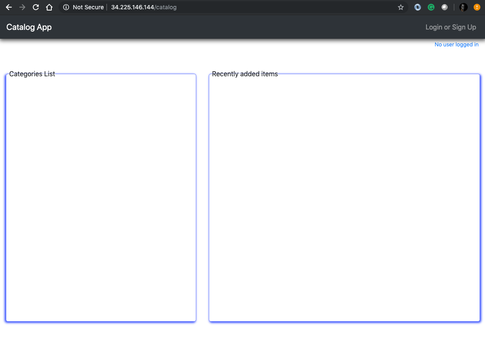


The configuration guide on how to setup the virtual host can be found [here](https://modwsgi.readthedocs.io/en/develop/user-guides/quick-configuration-guide.html)

### Ad hoc app configuration
A best practice would be to create a configuration file just for the application.
This will involve the implementation of the WSGIDeamonProcess which I'll not cover here.

To get started you can follow this [guide](https://www.digitalocean.com/community/tutorials/how-to-install-the-apache-web-server-on-ubuntu-18-04-quickstart)


### Useful commands
Enable the conf file with `a2ensite`:
```sh
sudo a2ensite <fileName>.conf
```
Disable the defualt site defined in `000-default.conf`:
```sh
$ sudo a2dissite 000-default.conf
```
Test the configuration:
```sh
$ sudo apache2ctl configtest
```

Restart the server:
```sh
$ sudo apache2ctl restart
```
Error log can be found at:
```sh
$ sudo cat /var/log/apache2/error.log
```

Enable verbose logs
```sh
sudo nano /etc/apache2/apache2.conf
```
Locate the LogLevel variable, and update it from the default warn to info or debug. debug will produce the greatest amount of output.
```
# LogLevel: Control the number of messages logged to the error_log.
# Possible values include: debug, info, notice, warn, error, crit,
# alert, emerg.
# 
LogLevel debug
```
Restart Apache
```sh
$ sudo service apache2 restart
```
Apache includes a nice little syntax checking tool
```sh
$ apache2ctl -t
```
Checking Virtual Host Definitions
```sh
$ apache2ctl -S
```
Become the root user:
```sh
$ sudo -i
```

Set the password to root user:
```sh
$ sudo passwd root
```

Login as root with the password:
```sh
$ su -
```

To properly check if all the packages have been updated to the most recent version you can use this command:
```sh
$ sudo apt-get upgrade --dry-run | grep 'upgraded'
```

If you get a message saying that some packages have not been updated or some other cryptic information, you can fix this (ubuntu bug) by installing `aptitude`.
```sh
$ sudo apt-get install aptitude
```

Then run the following:
```sh
$ sudo aptitude update
$ sudo aptitude safe-upgrade
```

If you want just to see what will happen when you run the aptitude commands, add the --dry-run flag.

```sh
$ apt upgrade --dry-run
```

Restart ubuntu machine
```sh
$ sudo /sbin/shutdown -r now
```
___


## References
[Secure postgres on ubuntu](https://www.digitalocean.com/community/tutorials/how-to-secure-postgresql-on-an-ubuntu-vps)
<br>
[SQLAlchemy engine configuration](https://docs.sqlalchemy.org/en/latest/core/engines.html#postgresql)
<br>
[Downlaod and setup PuTTY](https://lightsail.aws.amazon.com/ls/docs/en/articles/lightsail-how-to-set-up-putty-to-connect-using-ssh)
<br>
[Copy paste in lightsail terminal](https://forums.aws.amazon.com/thread.jspa?messageID=814852&tstart=0)
<br>
[PostgreSQL roles](http://www.postgresqltutorial.com/postgresql-roles/)
<br>
[Drop table](http://www.postgresqltutorial.com/postgresql-drop-table/)
<br>
[Listing db](https://chartio.com/resources/tutorials/how-to-list-databases-and-tables-in-postgresql-using-psql/)
<br>
[Virtual Host](https://modwsgi.readthedocs.io/en/develop/user-guides/quick-configuration-guide.html)
<br>
[WSGIDeamonProcess](https://modwsgi.readthedocs.io/en/develop/configuration-directives/WSGIDaemonProcess.html)
<br>
[Send email notification from server](https://www.digitalocean.com/community/tutorials/how-to-install-and-configure-postfix-as-a-send-only-smtp-server-on-ubuntu-14-04)
<br>
[Protect the server - Fail2Ban](https://www.digitalocean.com/community/tutorials/how-to-protect-an-apache-server-with-fail2ban-on-ubuntu-14-04)
<br>
[Automatic security updates](https://help.ubuntu.com/community/AutomaticSecurityUpdates)
<br>
[Serve application with Gunicorn and Nginx](https://www.digitalocean.com/community/tutorials/how-to-serve-flask-applications-with-gunicorn-and-nginx-on-ubuntu-14-04)
<br>
[System monitoring with Nagios](https://www.digitalocean.com/community/tutorials/how-to-install-nagios-4-and-monitor-your-servers-on-ubuntu-14-04)
[System monitoring with Glances](https://pypi.org/project/Glances/)
<br>
[How to deploy Flask app on Ubuntu](https://www.digitalocean.com/community/tutorials/how-to-deploy-a-flask-application-on-an-ubuntu-vps#step-four-%E2%80%93-configure-and-enable-a-new-virtual-host)
